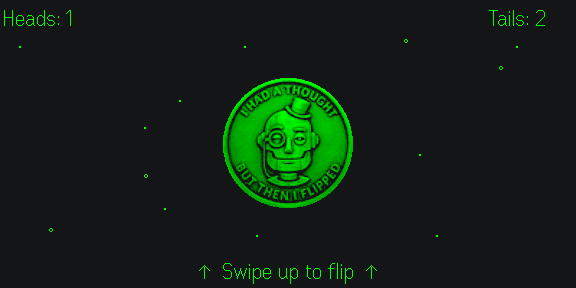
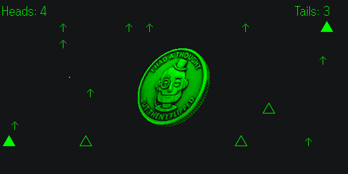
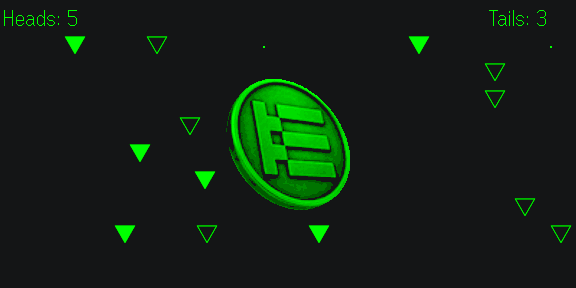
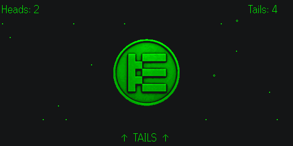
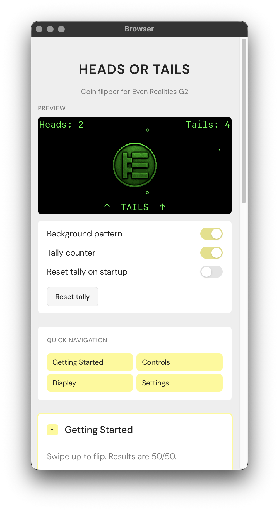

# Heads or Tails

Coin flip for **Even Realities G2** smart glasses: swipe up to flip a coin on the 576×288 HUD, with an animated tumble, drizzle background, and an optional Heads/Tails tally. Use the touchpad or ring controller (R1).

This project is licensed under the MIT License — see [LICENSE](LICENSE).

## Screenshots

| Heads | Heads — flipping |
|-------|------------------|
|  |  |

| Tails — flipping | Tails |
|------------------|-------|
|  |  |

| Phone UI |
|----------|
|  |

## Quick links

- **In-app help:** Open the app on your phone to see the live HUD preview and settings (background pattern, tally counter, reset tally). Same page as [index.html](index.html) in this repo.

## Tech stack

- **Runtime:** TypeScript, Vite
- **Glasses:** [Even Hub SDK](https://www.npmjs.com/package/@evenrealities/even_hub_sdk) — containers, 1-bit images, touchpad/ring events
- **Layout:** [@evenrealities/pretext](https://www.npmjs.com/package/@evenrealities/pretext) for text measurement
- **Images:** [upng-js](https://www.npmjs.com/package/upng-js) for coin frame decoding/encoding

## Project structure

```
EvenHeadsOrTails/
├── index.html        # WebView host + phone preview
├── src/
│   ├── main.ts       # SDK bridge, containers, input routing
│   ├── flip.ts       # Flip animation and result logic
│   ├── layout.ts     # Container definitions
│   ├── drizzle.ts    # Background animation frames
│   ├── assets.ts     # Coin image loading
│   ├── bridgeQueue.ts# Serial BLE bridge-call queue
│   ├── keepAlive.ts  # WebView keep-alive (audio + Web Lock)
│   ├── storage.ts    # Tally + settings persistence
│   └── preview.ts    # Phone-side HUD mirror
├── public/coin/      # Coin frame art (heads/tails, half, rotated)
├── app.json          # Even Hub manifest
└── vite.config.ts    # Dev server (port 5173, LAN binding)
```

## Prerequisites

- **Even Realities** — G2 glasses and the [Even App](https://www.evenrealities.com/) (so you can open the widget and see the coin HUD on your glasses).
- **Node.js** — v20.19.0 or newer. [Download Node.js](https://nodejs.org/) if you don’t have it; the installer is enough.

## Setup

1. **Clone and install**
   - Open a terminal (Command Prompt, PowerShell, or Terminal app).
   - Clone the repo (use the project’s clone URL from GitHub, or your fork):
     ```bash
     git clone https://github.com/dmyster145/EvenHeadsOrTails.git
     cd EvenHeadsOrTails
     ```
   - Install dependencies:
     ```bash
     npm install
     ```

2. **Run locally**
   ```bash
   npm run dev
   ```
   - You’ll see a local URL (e.g. `http://localhost:5173`). Keep this terminal open while you use the app.

3. **Open on the glasses**
   - **Simulator:** `npm run simulate` to run the desktop simulator against the dev server.
   - **Real glasses:** `npx evenhub qr --url http://<your-computer-ip>:5173` and scan the QR code with the Even App to open the widget on your G2 glasses.

4. **Try it**
   - On your **phone:** Open the same URL in a browser to see the [help page](index.html) — a live HUD preview and the settings toggles.
   - On your **glasses:** Swipe up to flip; the coin tumbles and lands on heads or tails.

## Usage on the glasses

- **Swipe up** — Flip the coin. Swipe up again on a result to flip immediately.
- **Tap / swipe down** — Dismiss the result and return to the idle prompt.
- **Double-tap (from idle)** — Open the exit dialog.

## Scripts

| Command            | Description               |
|--------------------|---------------------------|
| `npm run dev`      | Start dev server          |
| `npm run build`    | Build for production      |
| `npm run preview`  | Preview production build  |
| `npm run simulate` | Run the desktop simulator |
| `npm run pack`     | Pack into an `.ehpk`      |

## Build and pack

```bash
npm run build
npm run pack
```

`build` outputs to `dist/`; `pack` produces `heads-or-tails.ehpk` for distribution. Deploy `dist/` to any static host, then open the deployed URL in the Even App to use the widget in production.

## Features (summary)

- **Fair flips:** Outcomes use `crypto.getRandomValues()` for a true 50/50.
- **Animated tumble:** Multi-frame coin rotation over a drizzle background.
- **Tally counter:** Optional running Heads/Tails totals, persisted across sessions, with a reset option.
- **Settings (phone):** Toggle the background pattern, the tally counter, and reset-on-startup; reset the tally on demand.
